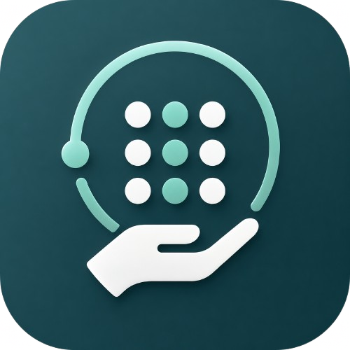
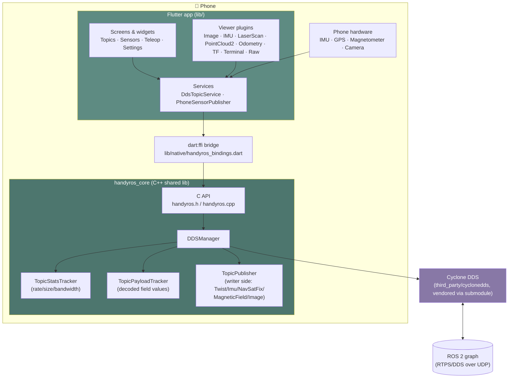
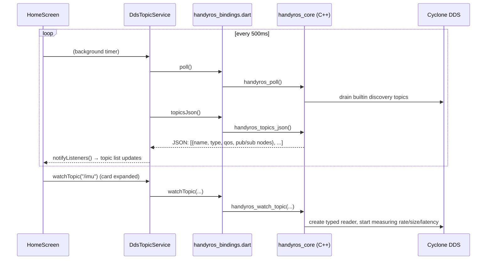
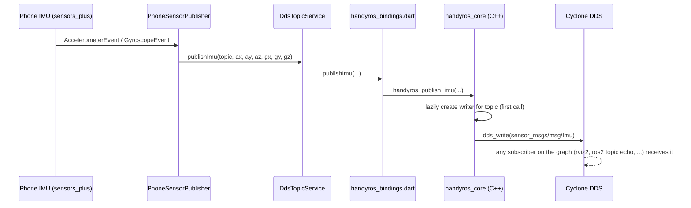

<p align="center">
  
</p>

<h1 align="center">HandyROS</h1>

<p align="center"><strong>A native mobile client for ROS 2 — no rosbridge, no intermediary server.</strong></p>

HandyROS talks directly to your robot's DDS graph from a phone: it discovers
topics, decodes and visualizes live sensor data, and can publish back onto
the graph — turning the phone itself into a sensor source and a teleop
controller. Everything goes over the same RTPS/DDS wire protocol `ros2 topic
list`/`ros2 topic echo` use, via a native C++ core (`handyros_core/`) bound
into a Flutter UI through `dart:ffi`.

## What it does today

| Tab | What it does |
|---|---|
| **Topics** | Live discovery of every topic on the graph (name, type, QoS, publisher/subscriber nodes), real rate/bandwidth/latency stats, and a per-type visualizer for the ones HandyROS knows how to decode. |
| **Sensors** | Publishes the *phone's own* hardware onto topics you name: IMU (accel+gyro), GPS, magnetometer, camera. |
| **Teleop** | A virtual joystick (surge/sway) plus yaw arrows, publishing `geometry_msgs/Twist` to a topic you set (default `/cmd_vel`). |
| **Settings** | ROS Domain ID, light/dark/system theme, registered viewer list. |

## Architecture



`handyros_core` generates typed C bindings for every standard ROS 2 message
type at **build time**, by running Cyclone's own `idlc` against the real
`.idl` files a ROS 2 Humble install ships (`std_msgs`, `sensor_msgs`,
`geometry_msgs`, `nav_msgs`, `tf2_msgs`, and more — see `CMakeLists.txt`).
That's what lets `TopicStatsTracker`/`TopicPayloadTracker`/`TopicPublisher`
read and write real ROS messages without hand-written CDR (de)serialization
for each type.

## How data flows

**Discovering & watching a topic** (Topics tab):



**Publishing from the phone** (Sensors / Teleop tabs):



Teleop follows the same shape: the virtual joystick + yaw arrows feed a 20Hz
timer that calls `publishTwist(...)`, and a zero-`Twist` is sent the instant
the stick is released, Stop is tapped, or the Teleop tab is switched away
from — the app never leaves a stale non-zero command on the wire.

## Project layout

```
lib/
├── app/          theme.dart — neumorphic design tokens, light/dark palettes
├── core/         viewer plugin registry (message type → visualizer)
├── models/       plain data classes (Topic, live-payload samples, TF frames)
├── native/       dart:ffi bindings to handyros_core's C API
├── screens/      top-level tabs (Topics/Sensors/Teleop/Settings) + pushed routes
├── services/     DdsTopicService, PhoneSensorPublisher, AppSettings, fakes for tests
├── viewers/      per-message-type visualizers (canvas painters, IMU/odom/TF readouts, ...)
└── widgets/      reusable pieces (topic card, search bar, filter chips, virtual joystick)

handyros_core/
├── include/      public headers (handyros.h is the FFI-facing C API)
├── src/          DDSManager, TopicStatsTracker, TopicPayloadTracker, TopicPublisher
├── idl_patches/  hand-fixed copies of a couple of ROS 2 .idl files idlc chokes on
├── tools/        patch_idl.py — resolves/patches the full transitive .idl dependency set
└── CMakeLists.txt

third_party/
└── cyclonedds/   git submodule, pinned — only actually built for the Android target
                  (the Linux dev-loop build links the ROS 2 apt package's Cyclone DDS)
```

## Building & running

### Prerequisites

- Flutter SDK
- A ROS 2 Humble install (native lib build uses its `idlc` and `.idl` files —
  even when cross-compiling for Android, `idlc` runs on your build host)
- For Android: Android SDK + NDK 27+

### Flutter app

```bash
flutter pub get
flutter run                 # run on a connected device/emulator
flutter test                 # run the test suite
flutter analyze              # static analysis
```

### Native core — Linux (dev loop)

Links against the ROS 2 Humble apt package's Cyclone DDS directly — fastest
path for iterating on `handyros_core` itself.

```bash
source /opt/ros/humble/setup.bash   # only needed if CycloneDDS isn't already on CMAKE_PREFIX_PATH
cmake -S handyros_core -B handyros_core/build
cmake --build handyros_core/build
./handyros_core/build/test_handyros   # smoke test: discovers topics for 3s and prints them
```

### Native core — Android (arm64)

Cyclone DDS itself has to be cross-compiled first (the apt package is
x86_64-only); `idlc` still runs on your Linux host either way.

```bash
# 1. Build Cyclone DDS for arm64 (submodule at third_party/cyclonedds)
cmake -S third_party/cyclonedds -B third_party/cyclonedds/build-android-arm64 \
      -DCMAKE_TOOLCHAIN_FILE="$ANDROID_NDK_HOME/build/cmake/android.toolchain.cmake" \
      -DANDROID_ABI=arm64-v8a \
      -DANDROID_PLATFORM=android-24 \
      -DCMAKE_INSTALL_PREFIX="$PWD/third_party/install-android-arm64" \
      -DBUILD_IDLC=OFF -DENABLE_SHM=OFF -DBUILD_EXAMPLES=OFF -DBUILD_TESTING=OFF
cmake --build third_party/cyclonedds/build-android-arm64 --target install

# 2. Cross-compile handyros_core itself against that
cmake -S handyros_core -B handyros_core/build-android-arm64 \
      -DCMAKE_TOOLCHAIN_FILE="$ANDROID_NDK_HOME/build/cmake/android.toolchain.cmake" \
      -DANDROID_ABI=arm64-v8a \
      -DANDROID_PLATFORM=android-24 \
      -DCycloneDDS_DIR="$PWD/third_party/install-android-arm64/lib/cmake/CycloneDDS"
cmake --build handyros_core/build-android-arm64

# 3. Bundle it into the Flutter app
cp handyros_core/build-android-arm64/libhandyros_core.so \
   android/app/src/main/jniLibs/arm64-v8a/libhandyros_core.so

flutter build apk --debug
```

The app falls back to mocked data (`FakeTopicService`) if the native library
isn't present for the current platform, so `flutter run` still works for UI
iteration without any of the above.

## Status

The Flutter UI, real DDS discovery/decode, and now the writer side (Sensors +
Teleop) are all wired up and working end-to-end against a live ROS 2 graph.
iOS packaging of the native lib doesn't exist yet — Android is the only
platform with real DDS today.
